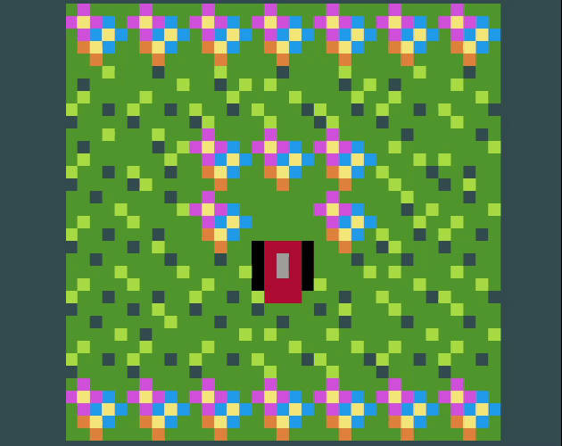

# [Puzzlescript Lawnmower](https://winterbeak.itch.io/puzzlescript-lawnmower)
A game for the [FUNDAV Mystery Jam](https://itch.io/jam/mystery-jam/entries), written in [Puzzlescript](https://www.puzzlescript.net/).  

Puzzlescript was not intended for making realtime games, so I made a realtime game.

## Featuring
- 68 levels of hot lawn mowing action
- 3 different power ups to really get your mow going
- A captivating story about the wrath of man

## To run this code:
Hop on over to [the puzzlescript editor](https://www.puzzlescript.net/editor.html) and paste the contents of [PUZZLESCRIPT LAWNMOWER.txt](https://github.com/winterbeak/puzzlescript-lawnmower/blob/main/PUZZLESCRIPT%20LAWNMOWER.txt) in.

Note that the level select and music was done using [PedroPSI's Puzzlescript Game Bar](https://pedropsi.github.io/game-bar.html) and is not included in this source code.
